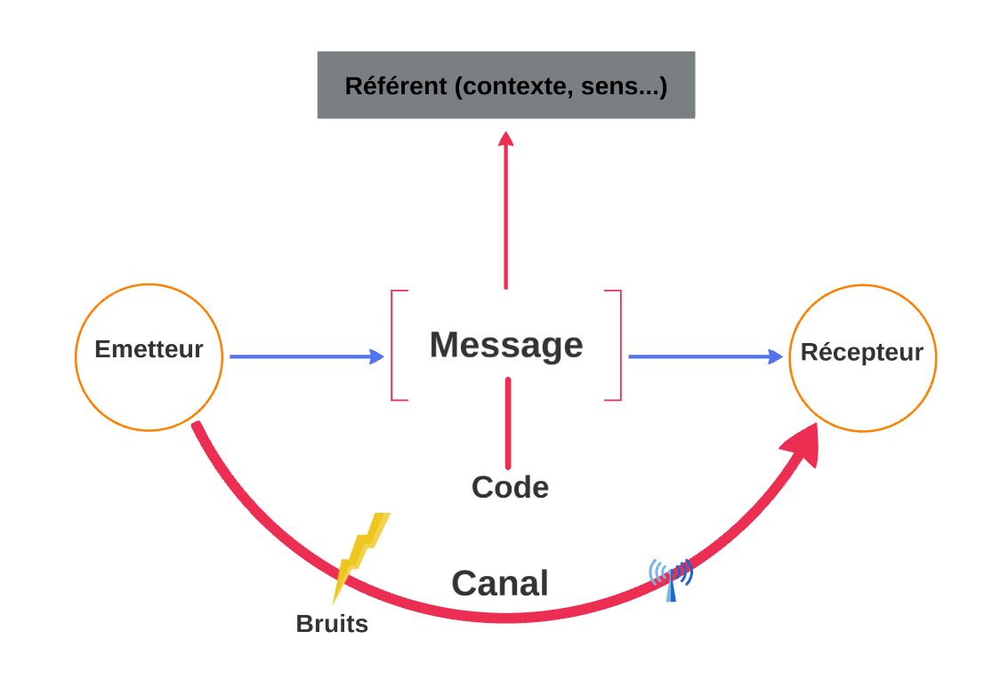

# C11
## Chapitre 1 rédaction d'email professionnels
* copier coller dans chatgtp (**ne pas reformuler juste corriger**)
* ameliorer le taux d'ouverture
  * Nom d'utilisateur (expéditeur)
  * Objet (bien séparées les sujet)
  * Jour et heure d'envoi
* ne pas oublie la signature 
  * politesse
  * Prenom Nom
  * en tant que 
## Chapitre 2 Raisonnement en langage naturel
* si A, alors B ou A implique B 
* a =>B alors non B => non A 
### Syllogisme
1. Tous les *A* sont *B*
2. OR *C* est un *A* 
3. DONC *C* est B  
### Syllogisme negatif
1. Tous les A sont B 
2. OR C n'est pas B 
2. => C n'est pas un A 
## Chapitre 3 Problème généraux de la communication 
### Intro 
* information --> très important / ensemble de donné 
* donné 
* Signal --> impulsion électrique
## Schéma

## Different probleme
* Réception : aucun accusé de réception
* Référenece : mot plusieur sens / mauvais lien 
* Canal : le message n'arrive pas
* Emetteur : message imconplet / pas claire / info inutile
* Code : mot inconnu / mauvaise compréhension 
## EXO
* problème reception ex : journale
* problème de référence ex : médecin 
* problème de canal : serveur
* problème de Code ex: bretzels / question a peine interogative
* problème emetteur ex: "euh oui"
## Redaction
### schéma a suivre
* défint problème
* localisation / exemple

### exemple

[...] 

La deuxième difficulté de comm relevé dans cette situation est lié au canal: parfois le message est
interrrompu ou altéré par des interférance / bruits parasite sur la canal. Ici, c'est le cas lorsque
G appelle un serveur. Celui-ci ne percoit pas cette info a cause de l'agitation. Résultat: l'info ne peut pas être traité correctement 

